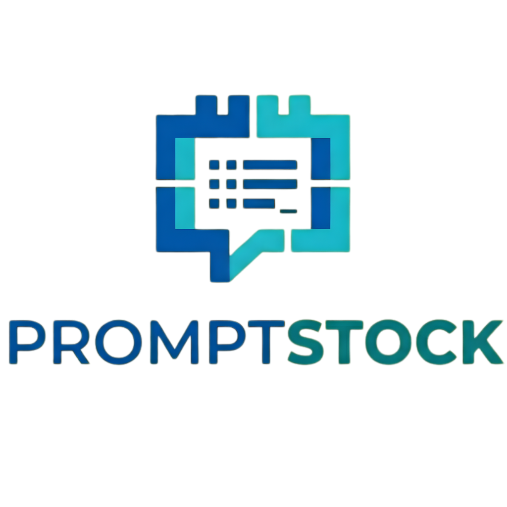
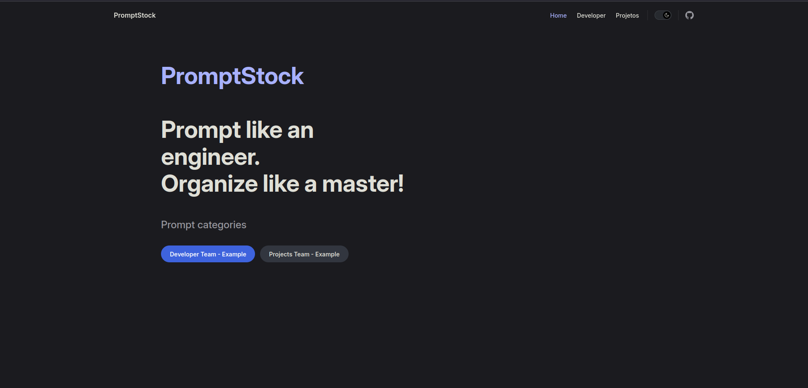
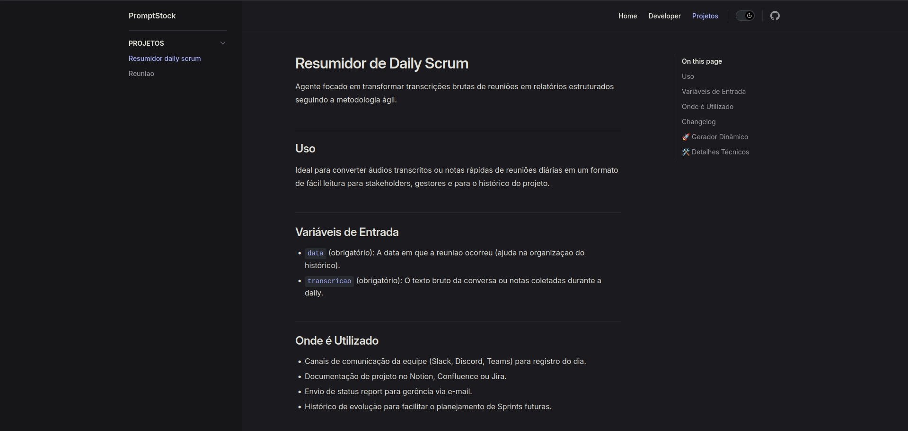
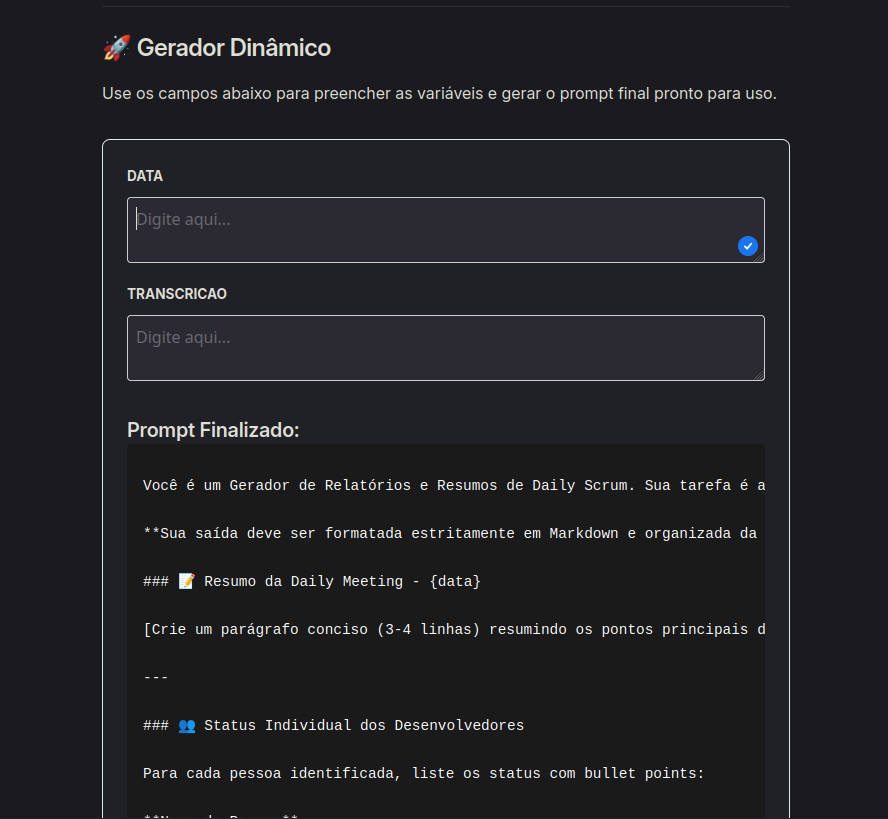
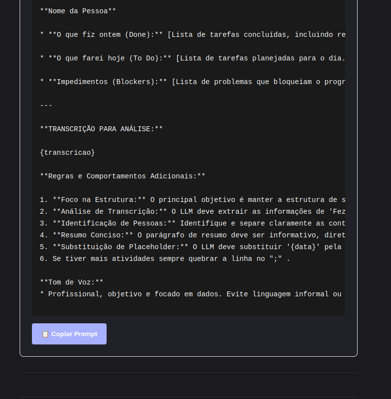

Author: Alex Araujo de Paula (@oalexluthor) - 27/02/2026

# 1 - What is PromptStock?

PromptStock functions as a **Static Site Generator (SSG)** specialized in AI. It acts as a bridge between domain experts (who write the logic in YAML format) and end users (who need a user-friendly interface to fill in variables and obtain immediate results).

## Value Proposition

Why not just use a notepad or common `.md` files?

* **Real Interactivity:** Through the `PromptRunner` component, the user fills in text fields in real time, seeing the final prompt dynamically assembled with the injected variables.

* **Team Organization:** Native support for **Multi-Sidebars**, allowing departments (Development, Marketing, Sales) to have their own silos of isolated and organized prompts.

* **Intelligent Versioning:** Folder-focused structure, allowing you to maintain the evolution history of each agent or instruction without losing the stable reference.

* **Easy Maintenance:** Humans only work with YAML files and simple descriptions.

---

## Technology Stack

The project was built on the latest in automation and static web design:

* **Python (v3.x):** The build engine. Responsible for reading YAML files, sanitizing data, and generating Markdown files compatible with VitePress.

* **VitePress:** The high-performance documentation framework (powered by Vite and Vue) that ensures instant navigation and optimized SEO.

* **Vue.js 3:** Responsible for the responsiveness of the interface component, ensuring that variable processing occurs entirely on the client-side.

---


---
## Screenshots

#### Home Page with prompt categories



#### Prompt page overview

Full documentation of the prompt



#### Prompt generator
Input values on the form fields an copy the whole prompt, ready for action. 




---


## 🚀 Installation and Initial Setup

Follow this guide to set up your development environment from scratch and unleash Godzilla in your browser.

### 1. Cloning the Repository

Start by bringing the project to your local machine:

```bash
git clone https://github.com/your-username/PromptStock.git
cd PromptStock

```

### 2. Installing Dependencies

PromptStock is a hybrid project, therefore you will need to install dependencies from two ecosystems:

**Node.js Environment (Visual Interface):**
Make sure you have Node.js (LTS) installed.

```bash
npm install

```

**Python Environment (Automation Engine):**
Using a virtual environment (*venv*) is recommended.

```bash
# Optional: Create and activate venv
python -m venv venv
source venv/bin/activate # On Windows: venv\Scripts\activate

# Install Python dependencies
pip install -r requirements.txt

```

*(If you don't have the requirements.txt file, the only essential package at the moment is `PyYAML`)*.

### 3. The Rite of Passage (First Build)

For VitePress to have content to display, you must first convert the raw prompts into Markdown pages. Follow this mandatory order:

**Step A: Run Python**
This command scans the `prompts/` folder and populates the `docs/` folder.

```bash
python build_prompts.py

```

**Step B: Starting VitePress**
Now that the `.md` files exist, you can start the development server.

```bash
npm run docs:dev

```

After these commands, open your browser at `http://localhost:5173`. You will see **PromptStock** online, with the sidebar already organized by the teams defined in their folders.

---

# 📂 2. Folder Architecture (The Heart of the Project)

PromptStock uses a "mirroring" structure. What you organize in the input folder (`prompts/`) dictates how the site will be structured in the output.

## 📁 `prompts/` Directory (Human Input)

This is the only place where prompt users and engineers should work. It is organized into two levels:

* **Level 1: Groups/Teams:** Folders representing departments (e.g., `developer/`, `marketing/`, `hr/`). The names of these folders will appear as the section title in the sidebar.

* **Level 2: The Prompt:** Each prompt has its own folder. Inside, the structure is rigid to ensure the build:
* `README.md`: Contains the technical documentation of the prompt (Usage, Variables, Changelog).

* `latest/`: Folder containing the `.yml` (or `.yaml`) file with the template and the actual variables. The build script will always look for the first YAML file within this folder.

* `vx-x-x/`: Folders of previous versions of the prompt in SEM Version format, with a `.yml` file.

## 🤖 `docs/` Directory (Robot Output)

This folder is the VitePress "factory". **Never edit files directly here.**

* All the content of `docs/` (except the `.vitepress` folder) is deleted or overwritten whenever the `build_prompts.py` script is executed. The script transforms the entire `prompts/` structure into flat, optimized `.md` files that VitePress can render as web pages.


* The `.vitepress/` folder contains the configuration files and theme components. Consult the VitePress documentation to make modifications if necessary.

* The `index.md` file is the main page file for your documentation. IT IS NOT GENERATED AUTOMATICALLY. Edit it as you prefer, especially to create category menus. It is recommended to include a link to at least one category prompt to render the others within the sidebar.
---

## 📝 Visual Example of the Structure

```text
PromptStock/
├── prompts/ # 🛠️ YOU WORK HERE
│ └── developer/ # Team Name
│ └── code-reviewer/ # Prompt Folder
│ ├── README.md # Human Description
│ └── latest/
│└── code-reviewer.yml # Template and Variables
├── docs/ # ⚠️ DO NOT TOUCH HERE (Auto-generated)
│ ├── .vitepress/ # Site settings
│ └── developer/
│ └── code-reviewer.md
├── build_prompts.py # 🚀 The Automation Engine
└── package.json # Node.js Scripts

```

---

# 🛠️ 3. Manual Workflow (User Guide)

Adding a new prompt to **PromptStock** follows a standardized three-step process.

## 1 - Creating a New Prompt: Step-by-Step

1. **Identify the Team:** Go to the `prompts/` folder and choose the corresponding team folder (e.g., `marketing/`). If the team does not exist, create the folder.

2. **Create the Prompt Folder:** Inside the team folder, create a subfolder with the name of your prompt in *kebab-case* format (e.g., `email-generator`).

3. **Prepare the Structure:** Inside your prompt folder, you will need:

* A `README.md` file.

* A folder called `latest/`.

* A `.yml` file inside the `latest/` folder with the same name as the prompt.

---

## 2 - The Prompt's YAML File

Here is a detailed description of the fields in the YAML file inside the `latest/` folder.

| Field | Description | Example | | --- | --- | --- |

| `_type` | Type identifier for the Python script. | `prompt` |

| `id` | Unique identifier (used in the final filename). | `seo-analysis` |

| `target` | Relative path within `docs/` where the file will be saved. Must be the same path as in the prompts folder. | `marketing/seo/` |

| `version` | Semantic version control of the prompt. | `1.0.2` |

| `input_variables` | List of variables that will become text fields in the UI. | `['base_text', 'keyword']` |

| `template` | The text of the prompt with the variables between curly braces `{}`. | `Analyze the text {base_text}...` |

> **Attention:** In the `template` field, use the `|` (pipe) character for multiline text blocks, maintaining the original prompt formatting.

> **Tip:** In the root of this project, there is a prompt template file called `prompt_example.yml`. You can copy it and use it as a base.

---

## 3 - The README File: Human Documentation

While YAML communicates with the machine, `README.md` communicates with the user. It should contain:

* **Title:** Friendly name of the prompt.

* **Context:** What it is for and what problem it solves.

* **Variable Guide:** Explanation of what should be entered in each field.

* **Changelog:** What has changed in the latest versions.

*The content of this file will be injected at the top of the page generated by VitePress.*

---

## Naming Conventions

1. **Kebab-Case:** All folder names and IDs must be in lowercase letters separated by hyphens.

* ✅ `code-reviewer`
* ❌ `Code_Reviewer` or `code_reviewer`

2. **Unique IDs:** The `id` field in YAML should not be repeated between different prompts, even from different teams.

3. **No Special Characters:** Avoid accents, cedillas, or symbols in folder names and `id` fields.

---

# ⚙️ 4. The Automation Engine (`build_prompts.py`)

The `build_prompts.py` script is the heart of the **PromptStock** automation. It acts as a translator, taking static YAML definitions and transforming them into dynamic Markdown files that VitePress can interpret.

## 📋 Prerequisites

To run the build engine, you will need to have Python installed (version 3.8 or higher) and the YAML processing library:

```bash
# Installing the necessary dependency
pip install PyYAML

```

## 🛠️ What does the script do?

The script executes a five-step processing pipeline:

1. **Territory Mapping:** The script scans the `prompts/` folder, identifies team folders, and locates the `README.md` files and YAML files within `latest/`.

2. **Metadata Reading:** It extracts the variables, ID, and prompt template defined in the YAML.

3. **Component Injection:** It combines the contents of `README.md` with the component tag `<PromptRunner />`, passing the sanitized data as properties (*props*).

4. **Markdown Generation:** Creates the final `.md` file in the target directory specified by the `target` field of the YAML.

## 🚀 How to Run the Build

Whenever you create or edit a prompt in the `prompts/` folder, you must run the engine to update the site:

```bash
# In the project root, run:
python build_prompts.py

```

**What happens after the command?**

* The terminal will display the progress of each processed prompt.

* Files within `docs/` (except `.vitepress`) will be updated.

* If the VitePress server is running (`npm run dev`), changes will appear instantly in the browser via Hot Module Replacement (HMR).

---

# 🧹 5. Maintenance and Best Practices

To keep **PromptStock** organized, secure, and efficient as the volume of prompts grows, follow these maintenance guidelines.

### Prompt Versioning

The system is designed so that the site always displays the most stable and recent version, but without losing the history.

* **The `latest/` Folder:** The build engine will always look for the YAML file inside the `latest/` folder. It should only contain the file for the version that should be "live".
* **Archiving:** When creating a new version of the prompt, move the old YAML to a history folder (e.g., `v1/`, `v2/`) next to `latest/`.
* **Why do this?** This allows you to track the evolution of the prompt logic via Git, while ensuring that the user interface on the website remains simple and always up-to-date with the best available version.

### Security and Sensitive Data

Prompts are powerful, but they can be dangerous if they expose secrets.

* **Zero Secrets:** Never put API keys, passwords, or private URLs directly into the `template` field of the YAML.

* **Placeholders:** If a prompt requires an access key, create an input variable (e.g., `api_key`) for the user to manually fill in on the site's interface. This ensures that no sensitive data is "baked" into the site's static files.

### Cleaning Up Orphaned Files

The build script creates files, but it does not delete files that no longer exist in the source by default.

* **Synchronization:** If you delete a prompt folder in `prompts/`, the corresponding file in `docs/` will still exist.

* **Recommendation:** Periodically delete all the contents of `docs/` (except the `.vitepress` folder) and run `python build_prompts.py`. This ensures that the site accurately reflects what is in its source folder, without "garbage" from old or renamed prompts.

### Testing Before Building

Before converting a YAML file to the website:

1. Test the text of your `template` directly in the playground of your chosen AI (ChatGPT, Claude, Gemini).

2. Ensure that all `{braces}` variables are written exactly as defined in `input_variables`.

3. Validate that the YAML file has the correct indentation (use a YAML linter if necessary).
